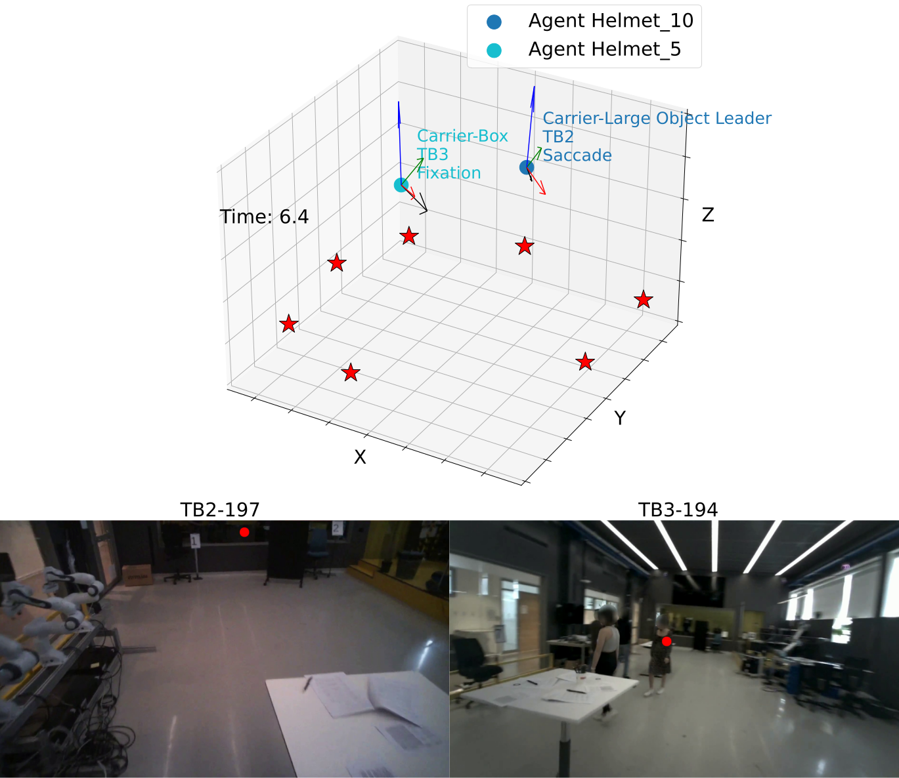

<!--## thor-magni-tools: Tools for Preprocessing and Filtering THÖR-MAGNI Human Motion Dataset-->

<h2 align="center">thor-magni-tools:&thinsp;Tools&thinsp;for&thinsp;Preprocessing&thinsp;and&thinsp;Filtering&thinsp;THÖR&hairsp;&#x0335;&hairsp;MAGNI&thinsp;Human&thinsp;Motion&thinsp;Dataset</h2>

<p align="center">
  <a href="http://thor.oru.se/magni.html"><strong><code>Project Page</code></strong></a>
  <a href="https://arxiv.org/abs/2403.09285"><strong><code>Paper</code></strong></a>
  <a href="https://magni-dash.streamlit.app"><strong><code>Dashboard</code></strong></a>
  <a href="https://zenodo.org/records/10554472"><strong><code>Dataset</code></strong></a>
</p>

<div align='center'>
  <br>
  <br>THÖR-MAGNI provides human gaze data aligned with 6D motion and human-robot interactions.
</div>


## Install

Install [miniconda](http://docs.conda.io/en/latest/miniconda.html). Then, you can install all packages required by running:

```
conda env create -f environment.yml && conda activate thor-magni-tools
```

## Running

### Download the dataset

First, the most important step is to download the dataset from [zenodo](10.5281/zenodo.10407222).
Run:

```
curl -O https://zenodo.org/records/10407223/files/THOR_MAGNI.zip\?download\=1 && unzip -r THOR_MAGNI.zip && rm -rf THOR_MAGNI.zip
```

The CSV files for each Scenario can be found in `THOR_MAGNI\CSVs_Scenarios`.


### CSV headers checker

To check the alignment and consistency of headers in the csv files:

```
python -m thor_magni_tools.run_header_check --dir_path=PATH_TO_SCENARIO_FOLDER --sc_id=Scenario_1
```

### Preprocessing


To preprocess the data with interpolation (and optional downsampling and moving average filter), first one should set the parameters in the [cfg file](https://github.com/tmralmeida/thor-magni-tools/blob/main/thor_magni_tools/preprocessing/cfg.yaml) and then run:

```
python -m thor_magni_tools.run_preprocessing 
```

If [in_path](https://github.com/tmralmeida/thor-magni-tools/blob/main/thor_magni_tools/preprocessing/cfg.yaml#L1) is a folder, it will preprocess the files in the folder in parallel. 
After finishing, the files will be stored in the [pre-specified output path](https://github.com/tmralmeida/thor-magni-tools/blob/main/thor_magni_tools/preprocessing/cfg.yaml#L2) with the 
format | time | frame_id | x | y | z | ag_id | agent_type, where `ag_id` is the helmet number and `agent_type` is the role of the participant.


### Analysis

```
python -m thor_magni_tools.run_analysis --data_path=DATASET_FOLDER OR DATASET FILE --dataset DATASET_NAME 
```

Such that `DATASET_NAME` in {"thor_magni", "thor", "eth_ucy", "sdd", "atc"}.

Optional Arguments:

| Parameter                 | Default       | Description   |	
| :------------------------ |:-------------:| :-------------|
| `--interpolation` 	        |	None          |used to preprocess the dataset. Max frames without tracking |
| `--average_window` 	        |	None          |used to preprocess the dataset. Number of periods to average |
| `--filtering_markers` 	    |	3D-restoration          |filtering markers type used in THÖR/THÖR-MAGNI tracks |


### Visualization of synchronized gazes and trajectory data



**Attention:** 

* This is only available for the latest [Zenodo version](https://zenodo.org/records/13865754).
* If you already have the `thor-magni-tools' conda environment installed, run:

```
conda activate thor-magni-tools && pip install opencv-python
```

To run the latest visualization tool, which allows you to view frame-by-frame the participant(s) wearing eye-tracking glasses, including their 6D head pose and 3D gaze (top), along with the corresponding 2D gaze (bottom), use the following command:

```
python -m thor_magni_tools.thor_magni_gazes.visualize --raw_file PATH_TO_CSV_RAW_FILE --max_nans_interpolate NUMBER_OF_MAX_QTM_FRAMES_TO_INTERPOLATE --visualization_step NUMBER_OF_FRAMES_LEAP_VISUALIZATION
```

Optional Arguments:

| Parameter                 | Default       | Description   |	
| :------------------------ |:-------------:| :-------------|
| `--max_nans_interpolate` 	        |	100          |max QTM (trajectory) frames to interpolate |
| `--visualization_step` 	    |	10          | visualization frames leap |

### :rocket: [New Feature 04/12/2024] Merging micro-actions with trajectory data


We present THÖR-MAGNI Act, an extension of the original THÖR-MAGNI dataset containing 8.3 hours of manually labeled participant actions derived from egocentric videos recorded with eye-tracking glasses.

We demonstrate the utility of THÖR-MAGNI Act for two tasks: action-conditioned trajectory prediction and joint action and trajectory prediction and joint action and trajectory prediction in this [paper](TODO) and [repo](TODO).


Run data merging:

```
python -m thor_magni_tools.run_actions_merging --actions_path PATH_TO_ACTIONS_FILE_MERGER --files_dir PATH_TO_TRAJECTORIES_DIR --out_path PATH_TO_OUTPUT_FILES
```

* ACTIONS_FILE_MERGER: [QTM_frames_activities.csv](TODO)
* PATH_TO_TRAJECTORIES_DIR: for instance, `outputs/data/thor_magni/Scenario_3/` storing the csv files from the preprocessing step
